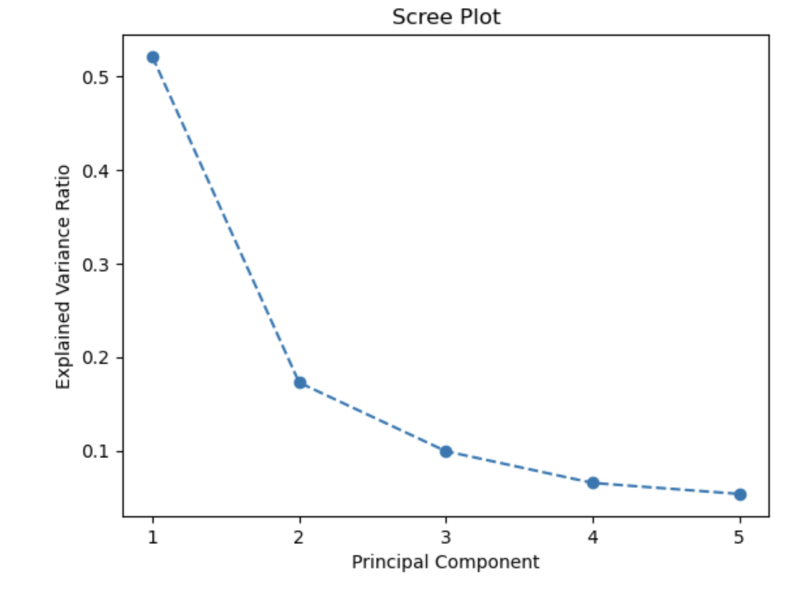
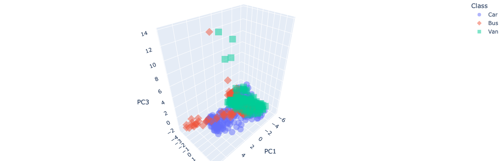

# Vehicle Classification using PCA and Machine Learning

## Overview

This project explores vehicle classification using machine learning and principal component analysis (PCA). The dataset contains measurements of vehicle shape and geometry, with the goal of classifying each sample into one of three classes:

- Bus
- Car
- Van

The workflow includes data preprocessing, dimensionality reduction with PCA, 3D visualisation of the transformed feature space, and classification using Gaussian Naive Bayes and Logistic Regression.

---

## Dataset

The dataset contains 18 numerical features describing vehicle characteristics, alongside a target column named `class`.

After preprocessing and removal of missing values, the final dataset used in the analysis contained:

- **813 samples**
- **18 input features**
- **3 target classes**: Bus, Car, Van

The class labels were encoded as:

- `0` = Bus
- `1` = Car
- `2` = Van

---

## Project Workflow

### 1. Data Preprocessing
- loaded the vehicle dataset using pandas
- encoded the categorical target variable using `LabelEncoder`
- checked for missing values
- removed rows containing missing values

### 2. Train / Validation / Test Split
The dataset was split into:
- **60% training**
- **20% validation**
- **20% testing**

### 3. Standardisation
The feature data was standardised using `StandardScaler` before applying PCA.

### 4. Principal Component Analysis
PCA was performed on the standardised training set, retaining enough components to explain **90% of the variance**.

This resulted in **5 principal components**.

### 5. Visualisation
The transformed data was visualised in 3D using the first three principal components.

### 6. Classification
Two classifiers were trained and evaluated on the PCA-transformed data:

- Gaussian Naive Bayes
- Logistic Regression

---

## PCA Results

PCA retained **5 principal components** to explain approximately **90% of the variance** in the dataset.

Explained variance ratios for the first five components:

- **PC1**: 0.5209
- **PC2**: 0.1727
- **PC3**: 0.0993
- **PC4**: 0.0655
- **PC5**: 0.0537

### Scree Plot



---

## 3D PCA Visualisations

### Training Set Projection


### Test Set Projection


### PCA Loadings Plot


---

## Model Performance

### Gaussian Naive Bayes
- **Validation Accuracy**: 69.33%
- **Test Accuracy**: 65.03%

### Logistic Regression
- **Validation Accuracy**: 71.17%
- **Test Accuracy**: 61.35%

### Summary
Logistic Regression achieved the highest validation accuracy, while Gaussian Naive Bayes achieved better performance on the held-out test set. This suggests that Gaussian Naive Bayes may have generalised slightly better for this dataset.

---

## Technologies Used

- Python
- Pandas
- NumPy
- Scikit-learn
- Matplotlib
- Plotly

---

## How to Run

Clone the repository:

```bash
git clone https://github.com/benjmoh/vehicle-classification-pca.git
cd vehicle-classification-pca

Install dependencies:

pip install -r requirements.txt

Open the notebook:

jupyter notebook vehicle-classification-pca.ipynb

Files

vehicle-classification-pca.ipynb — complete notebook containing preprocessing, PCA, visualisation, and classification

outputs/ — exported plots used in the README

requirements.txt — Python dependencies

Future Improvements

Potential future extensions include:

testing additional classification models such as SVM or Random Forest

hyperparameter tuning

adding confusion matrix visualisations to the README

performing feature importance analysis before PCA

comparing classification performance with and without PCA

Author

Benjamin Mohaci